# N&M18 TRANSPORT — Consolidated SEO Context & Technical Audit Document

> **Project Domain:** `https://www.nm18transport.com`  
> **Framework:** Next.js 14.2.3 (App Router with TypeScript)  
> **Document Purpose:** Comprehensive aggregation of technical SEO architecture, route hierarchies, metadata configurations, OpenGraph settings, Schema.org (JSON-LD) structured data, canonical tags, and semantic heading structures for external SEO specialists and technical audits.

---

## 1. Route Hierarchy & Indexing Architecture

The website employs a hybrid static and programmatic SEO architecture designed to capture localized searches, long-haul moving intents, and core logistics services.

```
/ (Homepage)
├── /service (Core Commercial Pillars)
│   ├── /moving (House, Condo, Room Moving)
│   ├── /pets (Pet Taxi & VIP Pet Relocation)
│   └── /moto (Motorcycle & Big Bike Transport)
├── /area (Regional Service Hubs)
│   ├── /bangkok-inner (Inner Bangkok Core)
│   ├── /thonburi (Thonburi Zone)
│   ├── /perimeter (Nonthaburi, Pathum Thani, Samut Prakan)
│   ├── /chiangmai (Chiang Mai Hub)
│   └── /chiangrai (Chiang Rai Hub)
├── /location/[district] (Programmatic Bangkok Sub-Districts / Zones)
│   └── [district] (50+ programmatic static pages generated from bangkok-locations.json)
├── /route/[origin]/[destination] (Programmatic Inter-Provincial Corridors)
│   └── [origin]/[destination] (Inter-provincial routes generated from long-haul-routes.json)
├── /blog (Content Marketing & Guides)
│   ├── /ultimate-moving-guide (Pillar moving guide)
│   └── /packing-fragile-items (Fragile packing checklist)
├── /contact (Contact, Location Map, Booking FAQ)
└── /works (Portfolio & Work Gallery Showcase)
```

### Route Indexing Matrix

| Route URL Pattern | Page Type | Rendering Strategy | Canonical Target | Sitemap Priority | Change Frequency |
| :--- | :--- | :--- | :--- | :--- | :--- |
| `/` | Homepage | Static (SSG) | `https://www.nm18transport.com/` | `1.0` | `daily` |
| `/service/moving` | Service Pillar | Static (SSG) | `/service/moving` | `0.8` | `weekly` |
| `/service/pets` | Service Pillar | Static (SSG) | `/service/pets` | `0.8` | `weekly` |
| `/service/moto` | Service Pillar | Static (SSG) | `/service/moto` | `0.8` | `weekly` |
| `/area/*` (5 zones) | Regional Hub | Static (SSG) | `/area/[zone-slug]` | `0.7` | `weekly` |
| `/location/[district]` | Programmatic Local | SSG via `generateStaticParams` | `/location/[district]` (Active) / Noindex for Alias & Draft | `0.6` | `weekly` |
| `/route/[origin]/[dest]` | Programmatic Routes | SSG (`dynamicParams: false`) | `/route/[origin]/[dest]` | `0.75 - 0.85` | `weekly` |
| `/blog/*` (2 guides) | Pillar Content | Static (SSG) | `/blog/[post-slug]` | `0.8` | `weekly` |
| `/contact` | Commercial/Trust | Static (SSG) | `https://www.nm18transport.com/contact` | `0.8` | `daily` |
| `/works` | Social Proof/Portfolio | Static (SSG) | `/works` | `0.8` | `daily` |

---

## 2. Core Configurations & Indexing Directives

### 2.1 Dependencies (`package.json`)
```json
{
  "dependencies": {
    "next": "14.2.3",
    "react": "^18",
    "react-dom": "^18",
    "react-icons": "^5.6.0"
  },
  "devDependencies": {
    "@types/node": "^20",
    "@types/react": "^18",
    "@types/react-dom": "^18",
    "eslint": "^8",
    "eslint-config-next": "14.2.3",
    "postcss": "^8",
    "sharp": "^0.35.1",
    "tailwindcss": "^3.4.1",
    "typescript": "^5"
  }
}
```

### 2.2 Next.js Config (`next.config.mjs`)
```javascript
/** @type {import('next').NextConfig} */
const nextConfig = {
  images: {
    formats: ['image/avif', 'image/webp'],
    remotePatterns: [
      {
        protocol: 'https',
        hostname: 'lh3.googleusercontent.com',
      },
    ],
  },
};

export default nextConfig;
```

### 2.3 Robots Configuration (`src/app/robots.ts`)
```typescript
import { MetadataRoute } from "next";

export default function robots(): MetadataRoute.Robots {
  return {
    rules: {
      userAgent: "*",
      allow: "/",
      disallow: "/api/",
    },
    sitemap: "https://www.nm18transport.com/sitemap.xml",
  };
}
```

### 2.4 Dynamic XML Sitemap Generator (`src/app/sitemap.ts`)
```typescript
import { MetadataRoute } from "next";
import locations from "../data/bangkok-locations.json";
import routes from "../data/long-haul-routes.json";

export default async function sitemap(): Promise<MetadataRoute.Sitemap> {
  const domain = "https://www.nm18transport.com";

  // Core pages
  const corePages = ["", "/works", "/contact"].map((route) => ({
    url: `${domain}${route}`,
    lastModified: new Date(),
    changeFrequency: "daily" as const,
    priority: route === "" ? 1.0 : 0.8,
  }));

  // Service pages
  const servicePages = ["/service/moving", "/service/pets", "/service/moto"].map((route) => ({
    url: `${domain}${route}`,
    lastModified: new Date(),
    changeFrequency: "weekly" as const,
    priority: 0.8,
  }));

  // Area pages
  const areaPages = [
    "/area/thonburi",
    "/area/bangkok-inner",
    "/area/perimeter",
    "/area/chiangmai",
    "/area/chiangrai",
  ].map((route) => ({
    url: `${domain}${route}`,
    lastModified: new Date(),
    changeFrequency: "weekly" as const,
    priority: 0.7,
  }));

  // Blog pages
  const blogPages = [
    "/blog/ultimate-moving-guide",
    "/blog/packing-fragile-items",
  ].map((route) => ({
    url: `${domain}${route}`,
    lastModified: new Date(),
    changeFrequency: "weekly" as const,
    priority: 0.8,
  }));

  // Programmatic location pages (index only verified active locations)
  const locationPages = locations
    .filter((loc) => loc.status === "active")
    .map((loc) => ({
      url: `${domain}/location/${loc.slug}`,
      lastModified: new Date(),
      changeFrequency: "weekly" as const,
      priority: 0.6,
    }));

  // Programmatic long-haul route pages
  const routePages = routes.map((route) => ({
    url: `${domain}/route/${route.originSlug}/${route.destinationSlug}`,
    lastModified: new Date(),
    changeFrequency: "weekly" as const,
    priority: route.isTopRoute ? 0.85 : 0.75,
  }));

  return [...corePages, ...servicePages, ...areaPages, ...blogPages, ...locationPages, ...routePages];
}
```

---

## 3. Global Site Layout & Root Metadata (`src/app/layout.tsx`)

### 3.1 Global Metadata Configuration
- **metadataBase:** `new URL("https://www.nm18transport.com")`
- **Title Template:** `%s | N&M18 TRANSPORT`
- **Default Title:** `N&M18 TRANSPORT - รถรับจ้างขนของ ย้ายคอนโด ย้ายหอพัก กรุงเทพ-ปริมณฑล เริ่ม 1,000.-`
- **Description:** `N&M18 TRANSPORT บริการรถรับจ้างขนของ รถกระบะตู้ทึบ รถ 4 ล้อใหญ่ ย้ายหอพัก ย้ายคอนโด ย้ายบ้าน กรุงเทพ-ปริมณฑลและทั่วไทย เริ่มต้น 1,000 บาท โทร 095-801-0958`
- **OpenGraph:**
  - `url`: `https://www.nm18transport.com`
  - `siteName`: `N&M18 TRANSPORT`
  - `images`: `[{ url: "/images/logos/logo-nm18.png", width: 800, height: 600, alt: "N&M18 TRANSPORT Logo" }]`
  - `locale`: `th_TH`
  - `type`: `website`
- **Twitter:** `summary_large_image`
- **Keywords:** 25 curated Thai transport terms (`รถรับจ้าง`, `รถขนของ`, `ย้ายบ้าน`, `ย้ายคอนโด`, `ย้ายหอพัก`, `รถกระบะตู้ทึบ`, `รถ 4 ล้อใหญ่รับจ้าง`, `ขนส่งมอเตอร์ไซค์`, `รถตู้ทึบกันฝน`, etc.)

### 3.2 Global Schema.org Graph (Root Layout JSON-LD)
```json
{
  "@context": "https://schema.org",
  "@graph": [
    {
      "@type": "MovingCompany",
      "@id": "https://www.nm18transport.com/#organization",
      "name": "N&M18 TRANSPORT",
      "image": "https://www.nm18transport.com/images/logos/logo-nm18.png",
      "description": "N&M18 TRANSPORT บริการรถรับจ้างขนของ รถกระบะตู้ทึบ รถ 4 ล้อใหญ่ ย้ายหอพัก ย้ายคอนโด ย้ายบ้าน กรุงเทพ-ปริมณฑลและทั่วไทย",
      "telephone": "+66958010958",
      "priceRange": "฿1,000 - ฿5,000",
      "url": "https://www.nm18transport.com",
      "address": {
        "@type": "PostalAddress",
        "addressCountry": "TH"
      },
      "areaServed": [
        "กรุงเทพมหานคร",
        "นนทบุรี",
        "ปทุมธานี",
        "สมุทรปราการ",
        "สมุทรสาคร",
        "สมุทรสงคราม",
        "เชียงใหม่",
        "เชียงราย"
      ],
      "openingHoursSpecification": {
        "@type": "OpeningHoursSpecification",
        "dayOfWeek": [
          "Monday", "Tuesday", "Wednesday", "Thursday", "Friday", "Saturday", "Sunday"
        ],
        "opens": "00:00",
        "closes": "23:59"
      }
    },
    {
      "@type": "WebSite",
      "@id": "https://www.nm18transport.com/#website",
      "url": "https://www.nm18transport.com",
      "name": "N&M18 TRANSPORT",
      "inLanguage": "th-TH",
      "publisher": {
        "@id": "https://www.nm18transport.com/#organization"
      }
    }
  ]
}
```

---

## 4. Homepage Breakdown (`src/app/page.tsx`)

### 4.1 Metadata & Canonical
- **Title:** `N&M18 TRANSPORT - รถรับจ้างขนของ ย้ายคอนโด ย้ายหอพัก กรุงเทพ-ปริมณฑล เริ่ม 1,000.-`
- **Description:** `N&M18 TRANSPORT บริการรถรับจ้างขนของ รถกระบะตู้ทึบ รถ 4 ล้อใหญ่ ย้ายหอพัก ย้ายคอนโด ย้ายบ้าน กรุงเทพ-ปริมณฑลและทั่วไทย เริ่มต้น 1,000 บาท โทร 095-801-0958`
- **Canonical:** `/`

### 4.2 Homepage Structured Data (BreadcrumbList Schema)
```json
{
  "@context": "https://schema.org",
  "@type": "BreadcrumbList",
  "itemListElement": [
    {
      "@type": "ListItem",
      "position": 1,
      "name": "หน้าแรก",
      "item": "https://www.nm18transport.com"
    }
  ]
}
```

### 4.3 Semantic Heading Hierarchy
- **H1:** บริการรถรับจ้างขนของ ย้ายหอพัก ย้ายคอนโด ย้ายบ้าน ทั่วประเทศ (`HeroSection.tsx`)
- **H2:** ราคาจริงใจ ไม่มีบวกเพิ่ม
- **H2:** ติดตามสถานะได้ตลอด
- **H2:** ทีมงานมืออาชีพ
- **H2:** ผลงานการขนส่ง
- **H2:** ทำไมต้องเลือก N&M18 TRANSPORT?
- **H2:** มั่นใจได้! เราจดทะเบียนขนส่งถูกต้องตามกฎหมาย
- **H2:** รีวิวจากผู้ใช้งานจริง
- **H2:** บริการของเรา
- **H2:** ค่าบริการเริ่มต้นเพียง
- **H2:** 4 ขั้นตอนง่ายๆ ในการใช้บริการ
- **H2:** คำถามที่พบบ่อย
- **H2:** พื้นที่ให้บริการยอดนิยมในกรุงเทพฯ & ปริมณฑล
- **H3:** 1. โทร/ไลน์ จองคิว
- **H3:** 2. รถเข้ารับสินค้า
- **H3:** 3. ขนส่งปลอดภัย
- **H3:** 4. ส่งถึงที่หมาย
- **H3:** โซนกรุงเทพเหนือ
- **H3:** โซนบางนา-สมุทรปราการ
- **H3:** โซนฝั่งธนบุรี
- **H3:** โซนใจกลางเมือง
- **H3:** โซนปริมณฑลยอดฮิต (นนทบุรี & สมุทรสาคร)
- **H3:** เส้นทางขนส่งต่างจังหวัดยอดฮิต

### 4.4 Homepage FAQ Items (`src/data/home-faq.ts`)
1. **Q: คิดค่าบริการขนส่งอย่างไร?**  
   *A:* ราคาขึ้นอยู่กับ ระยะทาง + ประเภทรถ + จำนวนคนยกของ ครับ แนะนำให้ทักแชทหรือโทรแจ้งต้นทาง-ปลายทาง เพื่อให้เราประเมินราคาเหมาจ่ายที่คุ้มที่สุดให้ฟรีครับ
2. **Q: สินค้าจะปลอดภัยไหม มีประกันหรือเปล่า?**  
   *A:* มั่นใจได้ 100% ครับ เรามีทีมงานมืออาชีพช่วยแพ็คกันกระแทก และมีการรัดตึงสินค้าไม่ให้ขยับระหว่างขนส่ง หากเกิดความเสียหายจากการขนส่ง เรารับผิดชอบตามตกลงครับ
3. **Q: มีคนช่วยยกของให้ด้วยไหม?**  
   *A:* มีครับ! ท่านสามารถแจ้งได้เลยว่าต้องการคนช่วยยกกี่คน ทางเรามีทีมงานพร้อมบริการยกของขึ้น-ลงรถ และจัดเรียงเข้าบ้านให้เรียบร้อย ท่านไม่ต้องเหนื่อยเองครับ
4. **Q: ควรจองคิวรถล่วงหน้ากี่วัน?**  
   *A:* แนะนำให้จองล่วงหน้า 1-2 วัน เพื่อล็อคคิวรถและเวลาที่แน่นอนครับ แต่ถ้าเป็นงานด่วน เรามีบริการรถสแตนด์บายตลอด 24 ชม. โทรเช็คคิวได้ทันทีครับ

---

## 5. Core Service Pages Breakdown

---

### 5.1 Service 1: House & Condo Moving (`src/app/service/moving/page.tsx`)

#### Metadata & Canonical
- **Title:** `รถรับจ้างย้ายบ้าน ย้ายหอพัก คอนโด รถกระบะ/4ล้อ ตู้ทึบ ราคาถูก - N&M18 TRANSPORT`
- **Description:** `บริการรถรับจ้างย้ายบ้าน ย้ายหอพัก ย้ายคอนโด ขนย้ายเฟอร์นิเจอร์ รถกระบะตู้ทึบ รถ 4 ล้อรับจ้าง พร้อมคนยกของ ราคาถูก ประเมินราคาฟรี วิ่งทั่วกรุงเทพฯ และต่างจังหวัด โทร 095-801-0958`
- **Keywords:** `รถรับจ้างย้ายบ้าน, รถรับจ้างขนของ, ย้ายหอพัก, รถ 4 ล้อรับจ้าง, รถกระบะรับจ้างขนของ, จ้างรถขนของ, ย้ายบ้านราคาถูก, รถรับจ้าง กรุงเทพ, ขนย้ายเฟอร์นิเจอร์, N&M18 TRANSPORT`
- **Canonical:** `/service/moving`
- **OpenGraph Type:** `article` | **OG Image:** `https://www.nm18transport.com/S__2531438.jpg`

#### JSON-LD Structured Data
```json
{
  "@context": "https://schema.org",
  "@type": "MovingCompany",
  "name": "N&M18 TRANSPORT",
  "image": "https://www.nm18transport.com/logo-nm18.png",
  "telephone": "095-801-0958",
  "url": "https://www.nm18transport.com/service/moving",
  "priceRange": "฿500 - ฿10,000",
  "address": {
    "@type": "PostalAddress",
    "addressLocality": "Bang Khae",
    "addressRegion": "Bangkok",
    "addressCountry": "TH"
  },
  "areaServed": [
    { "@type": "City", "name": "Bangkok" },
    { "@type": "City", "name": "Nonthaburi" },
    { "@type": "City", "name": "Pathum Thani" },
    { "@type": "City", "name": "Samut Prakan" },
    { "@type": "Country", "name": "Thailand" }
  ],
  "description": "บริการรถรับจ้างย้ายบ้าน หอพัก คอนโด ขนย้ายเฟอร์นิเจอร์ รถกระบะตู้ทึบและรถ 4 ล้อรับจ้าง พร้อมคนยกของมืออาชีพ ราคาถูก บริการ 24 ชม.",
  "openingHours": "Mo-Su 00:00-23:59"
}
```

#### Heading Structure & Content Hierarchy
- **H1:** ขนย้ายบ้าน หอพัก ครบวงจร
- **H2:** ภาพการทำงานจริง
- **H2:** ทำไมต้องเลือก N&M18?
- **H2:** คำถามที่พบบ่อย (FAQ) (`FAQClient.tsx`)
- **H3:** ทีมงานยกของ
- **H3:** บริการแพ็คกิ้ง
- **H3:** รถตู้ทึบ 100%
- **H3:** พื้นที่ให้บริการขนย้ายยอดนิยม
- **H4:** ประเมินราคาชัดเจน
- **H4:** รับประกันสินค้า 100%
- **H4:** อุปกรณ์ครบครัน
- **H4:** ชำนาญเส้นทาง
- **H4:** กรุงเทพฯ & ปริมณฑล
- **H4:** เส้นทางต่างจังหวัด
- **H4:** ประเภทรถให้บริการ

#### FAQ Content
- **Q: คิดราคาค่าขนย้ายยังไงครับ?**  
  *A:* ราคาขึ้นอยู่กับ 3 ปัจจัยหลัก: 1. ระยะทาง (ต้นทาง-ปลายทาง) 2. ประเภทรถที่ใช้ (กระบะ/6ล้อ) และ 3. จำนวนคนยกของ
- **Q: ต้องเก็บของลงกล่องเองไหม?**  
  *A:* ของจุกจิก เสื้อผ้า หนังสือ แนะนำใส่กล่องหรือถุงไว้ ส่วนเฟอร์นิเจอร์ชิ้นใหญ่ (ตู้ เตียง ทีวี) ทีมงานจะช่วยห่อกันกระแทกและยกให้
- **Q: ไปช่วยขนด้วยได้ไหม นั่งไปกับรถได้ไหม?**  
  *A:* ได้ครับ ติดรถไปกับคนขับได้ 1 ท่าน (สำหรับรถกระบะ) และจ้างเฉพาะรถอย่างเดียวได้หากมีคนยกเอง

---

### 5.2 Service 2: Pet Taxi & VIP Relocation (`src/app/service/pets/page.tsx`)

#### Metadata & Canonical
- **Title:** `รับส่งสัตว์เลี้ยง Pet Taxi รถเก๋ง/SUV แอร์เย็นฉ่ำ - N&M18 TRANSPORT`
- **Description:** `บริการรับส่งสัตว์เลี้ยง Pet Taxi รับส่งน้องหมา น้องแมว ไปต่างจังหวัดและในกรุงเทพฯ ด้วยรถยนต์ส่วนตัว (รถเก๋ง/SUV) แอร์เย็น ไม่ร้อน ดูแลเหมือนลูกหลาน ไม่ต้องขังหลังกระบะ โทร 095-801-0958`
- **Keywords:** `รับส่งสัตว์เลี้ยง, Pet Taxi, แท็กซี่สัตว์เลี้ยง, รับส่งน้องหมา, รับส่งน้องแมว, รถรับส่งสัตว์เลี้ยง, ส่งสัตว์เลี้ยงไปต่างจังหวัด, Pet Transport Thailand, รถรับจ้างขนสัตว์เลี้ยง, รถเก๋งรับจ้าง`
- **Canonical:** `/service/pets`
- **OpenGraph Type:** `article` | **OG Image:** `https://www.nm18transport.com/pet.jpg`

#### JSON-LD Structured Data
```json
{
  "@context": "https://schema.org",
  "@type": "TaxiService",
  "name": "N&M18 TRANSPORT Pet Taxi",
  "image": "https://www.nm18transport.com/logo-nm18.png",
  "telephone": "095-801-0958",
  "url": "https://www.nm18transport.com/service/pets",
  "priceRange": "฿500 - ฿5,000",
  "address": {
    "@type": "PostalAddress",
    "addressLocality": "Bang Khae",
    "addressRegion": "Bangkok",
    "addressCountry": "TH"
  },
  "areaServed": [
    { "@type": "City", "name": "Bangkok" },
    { "@type": "City", "name": "Nonthaburi" },
    { "@type": "City", "name": "Pathum Thani" },
    { "@type": "City", "name": "Samut Prakan" },
    { "@type": "City", "name": "Chon Buri" },
    { "@type": "City", "name": "Hua Hin" }
  ],
  "description": "บริการรับส่งสัตว์เลี้ยง Pet Taxi ทั่วไทย รถเก๋ง/SUV ส่วนตัว แอร์เย็น ไม่ขังกรงกระบะ เจ้าของนั่งไปด้วยได้ สะอาด ปลอดภัย",
  "openingHours": "Mo-Su 00:00-23:59"
}
```

#### Heading Structure & Content Hierarchy
- **H1:** รับส่งสัตว์เลี้ยง VIP CLASS ปลอดภัย ไม่ร้อน ถึงไว
- **H2:** ภาพผลงานการให้บริการรับส่งสัตว์เลี้ยง
- **H2:** ระบบความปลอดภัย ระดับพรีเมียม
- **H2:** คำถามที่พบบ่อย (FAQ) (`FAQClient.tsx`)
- **H3:** Cool Air System
- **H3:** Hygiene Standard
- **H3:** Live Updates
- **H3:** การเดินทางที่อบอุ่น ปลอดภัย ไร้ความกังวล
- **H3:** สิ่งที่ลูกค้าต้องเตรียมความพร้อม
- **H3:** พื้นที่ให้บริการและมาตรฐานยานพาหนะ
- **H4:** Door-to-Door Service
- **H4:** Express Delivery
- **H4:** Pet Lover Driver
- **H4:** ในกรุงเทพฯ & ปริมณฑล
- **H4:** ต่างจังหวัด (เหมาคัน)
- **H4:** มาตรฐานยานพาหนะ

#### FAQ Content
- **Q: เดินทางด้วยรถปรับอากาศ น้องจะร้อนหรืออึดอัดไหม?**  
  *A:* เย็นสบายและปลอดภัยแน่นอน ให้บริการด้วยรถห้องโดยสารปรับอากาศ 100% เปิดแอร์ตลอดทาง ไม่อบอ้าว ไม่นำน้องไปตากแดดหรือขังหลังกระบะ
- **Q: หากไม่มีกรงหรือ Box เดินทาง น้องขึ้นรถได้ไหม?**  
  *A:* แนะนำให้ใส่กรงหรือ Box เดินทางที่แข็งแรง กรณีตัวใหญ่หรือคุ้นชินการนั่งรถ ลูกค้าเตรียมผ้ารองและสายรัดนิรภัยมาได้
- **Q: ต้องจองคิวรถล่วงหน้ากี่วัน?**  
  *A:* แนะนำจองล่วงหน้า 1-3 วัน หากเร่งด่วนสามารถโทรเช็คคิวได้ 24 ชม.

---

### 5.3 Service 3: Motorcycle & Big Bike Transport (`src/app/service/moto/page.tsx`)

#### Metadata & Canonical
- **Title:** `รับส่งมอเตอร์ไซค์ ขนส่งบิ๊กไบค์ รถสไลด์/ตู้ทึบ ไปต่างจังหวัด ราคาถูก - N&M18 TRANSPORT`
- **Description:** `บริการขนส่งมอเตอร์ไซค์ รับส่งบิ๊กไบค์ (Big Bike) รถเล็ก รถวิบาก ฮาร์เลย์ เวสป้า ทั่วประเทศไทย ด้วยรถตู้ทึบ/รถสไลด์ มีประกันสินค้า 100% แพ็คกันรอยรอบคัน โทร 095-801-0958`
- **Keywords:** `ขนส่งมอเตอร์ไซค์, รับส่งบิ๊กไบค์, รถสไลด์มอเตอร์ไซค์, ส่งรถมอไซค์ไปต่างจังหวัด, รถรับจ้างขนรถ, ขนย้ายบิ๊กไบค์, รถตู้ทึบขนมอเตอร์ไซค์, ส่งรถฮาร์เลย์, ส่งรถเวสป้า, N&M18 TRANSPORT`
- **Canonical:** `/service/moto`
- **OpenGraph Type:** `article` | **OG Image:** `https://www.nm18transport.com/S__17556168.jpg`

#### JSON-LD Structured Data
```json
{
  "@context": "https://schema.org",
  "@type": "Service",
  "serviceType": "Motorcycle Transport Service",
  "provider": {
    "@type": "TransportationService",
    "name": "N&M18 TRANSPORT",
    "telephone": "095-801-0958",
    "image": "https://www.nm18transport.com/logo-nm18.png",
    "url": "https://www.nm18transport.com/service/moto",
    "address": {
      "@type": "PostalAddress",
      "addressLocality": "Bang Khae",
      "addressRegion": "Bangkok",
      "addressCountry": "TH"
    }
  },
  "areaServed": [
    { "@type": "City", "name": "Bangkok" },
    { "@type": "City", "name": "Nonthaburi" },
    { "@type": "City", "name": "Chiang Mai" },
    { "@type": "City", "name": "Phuket" },
    { "@type": "Country", "name": "Thailand" }
  ],
  "description": "บริการขนส่งมอเตอร์ไซค์ รับส่งบิ๊กไบค์ (Big Bike) รถสไลด์ รถตู้ทึบ รับถึงหน้าบ้าน ส่งถึงที่หมายทั่วไทย มีประกันสินค้า ปลอดภัย 100%",
  "offers": {
    "@type": "Offer",
    "priceCurrency": "THB",
    "price": "Call for price",
    "availability": "https://schema.org/InStock"
  }
}
```

#### Heading Structure & Content Hierarchy
- **H1:** ขนส่งบิ๊กไบค์ ระดับมืออาชีพ
- **H2:** ภาพผลงานจริง
- **H2:** คำถามที่พบบ่อย (FAQ) (`FAQClient.tsx`)
- **H3:** ทางลาดขึ้น-ลงสะดวก
- **H3:** แพ็คซีนกันรอย 100%
- **H3:** ล็อคล้อ 4 จุด
- **H3:** บริการ 24 ชั่วโมง
- **H3:** พื้นที่รับ-ส่งยอดนิยม (รับถึงหน้าบ้าน)
- **H4:** กรุงเทพ & ปริมณฑล
- **H4:** เส้นทางต่างจังหวัด
- **H4:** ประเภทรถที่รับขนส่ง

#### FAQ Content
- **Q: ต้องถ่ายน้ำมันออกไหมครับ?**  
  *A:* ไม่จำเป็นต้องถ่ายออกหมดครับ แต่แนะนำให้เหลือไว้พอสตาร์ทรถได้ มีการล็อครถแน่นหนาน้ำมันไม่หก
- **Q: ใช้เอกสารอะไรบ้างในการขนส่ง?**  
  *A:* 1. สำเนาบัตรประชาชนผู้ส่ง/ผู้รับ และ 2. สำเนาทะเบียนรถ (หรือเอกสารซื้อขาย) เพื่อยืนยันความเป็นเจ้าของ
- **Q: รถสไลด์ กับ รถตู้ทึบ ต่างกันยังไง?**  
  *A:* รถตู้ทึบกันฝน 100% ประหยัด เหมาะกับรถทั่วไป/บิ๊กไบค์; รถสไลด์ขึ้นลงสะดวก เหมาะกับรถโหลดเตี้ยมากหรือรถหรู

---

## 6. Regional Area Pages Breakdown (`src/app/area/*`)

All regional pages implement localized metadata, `Service` JSON-LD schema linked to `N&M18 TRANSPORT`, local service highlights, and localized keywords.

| Route | Canonical | Page Title | Schema `@type` & Area | Main Heading (H1) |
| :--- | :--- | :--- | :--- | :--- |
| `/area/bangkok-inner` | `/area/bangkok-inner` | รถรับจ้าง กรุงเทพชั้นใน ย้ายคอนโด สุขุมวิท รัชดา พระราม 9 สาทร - N&M18 TRANSPORT | `Service` (Bangkok Inner City, Sukhumvit, Sathorn, Rama 9, Ratchada) | รถรับจ้าง กรุงเทพชั้นใน สุขุมวิท - พระราม 9 - สาทร |
| `/area/thonburi` | `/area/thonburi` | รถรับจ้างฝั่งธน ขนของ ย้ายหอพัก โซนเพชรเกษม บางแค พระราม 2 - N&M18 TRANSPORT | `Service` (Thonburi, Bang Khae, Phetkasem, Rama 2, Pinklao) | รถรับจ้างฝั่งธนบุรี บางแค - เพชรเกษม - พระราม 2 |
| `/area/perimeter` | `/area/perimeter` | รถรับจ้าง ปริมณฑล นนทบุรี-ปทุม-สมุทรปราการ ย้ายบ้านราคาถูก - N&M18 TRANSPORT | `Service` (Nonthaburi, Pathum Thani, Samut Prakan) | รถรับจ้าง ปริมณฑล นนทบุรี - ปทุมธานี - สมุทรปราการ |
| `/area/chiangmai` | `/area/chiangmai` | รถรับจ้างขนของ เชียงใหม่ - กรุงเทพ (ไป-กลับ) ย้ายบ้าน ย้ายหอ ราคาถูก | `Service` (Chiang Mai, Mueang, Hang Dong, San Sai, Mae Rim) | รถรับจ้าง เชียงใหม่ - กรุงเทพ ขนของ ย้ายหอ ย้ายบ้าน ขึ้นดอย |
| `/area/chiangrai` | `/area/chiangrai` | รถรับจ้างขนของ เชียงราย-กรุงเทพ (ไป-กลับ) ย้ายบ้าน ย้ายหอ ราคาถูก | `Service` (Chiang Rai, Mueang, Mae Sai, Chiang Saen, Phan) | รถรับจ้าง เชียงราย - กรุงเทพ ย้ายหอ มฟล. ขนของ ส่งสินค้า |

---

## 7. Programmatic Location Architecture (`/location/[district]`)

### 7.1 Dynamic Generation Strategy
- **Data Source:** `src/data/bangkok-locations.json`
- **Static Generation:** Pre-rendered via `generateStaticParams()` across all dataset slugs.
- **Indexing Safety Mechanism:**
  - Active locations (`status: "active"`) render full content, canonical tags, and are included in `sitemap.ts`.
  - Alias locations (`status: "alias"`) trigger a server-side `redirect(/location/[canonicalSlug])` and emit `robots: { index: false, follow: true }`.
  - Draft / Pending verification locations emit `robots: { index: false, follow: true }` to prevent thin content indexing.

### 7.2 Dynamic Location Schema Generator
```json
{
  "@context": "https://schema.org",
  "@type": "Service",
  "@id": "https://www.nm18transport.com/location/[district-slug]#service",
  "name": "บริการรถรับจ้างขนของ [Thai District Name] - N&M18 TRANSPORT",
  "serviceType": "Moving Service",
  "provider": {
    "@id": "https://www.nm18transport.com/#organization"
  },
  "areaServed": {
    "@type": "AdministrativeArea",
    "name": "[Thai District Name]"
  },
  "offers": {
    "@type": "Offer",
    "price": "[startingPrice]",
    "priceCurrency": "THB",
    "url": "https://www.nm18transport.com/location/[district-slug]"
  }
}
```

### 7.3 Heading Hierarchy Template
- **H1:** รถรับจ้างขนของ [Thai District Name] บริการตลอด 24 ชั่วโมง
- **H2:** ทำไมต้องเลือกใช้บริการรถขนของในพื้นที่ [Thai District Name] กับ N&M18 TRANSPORT?
- **H3:** ประเภทรถรับจ้างที่ให้บริการในพื้นที่ [Thai District Name]:
- **H4:** รถกระบะรับจ้างตู้ทึบ
- **H4:** รถ 4 ล้อใหญ่ตู้ทึบ
- **H4:** บริการขนย้ายที่เกี่ยวข้องของเรา:

---

## 8. Programmatic Long-Haul Corridor Routes (`/route/[origin]/[destination]`)

### 8.1 Corridor Generation Strategy
- **Data Source:** `src/data/long-haul-routes.json`
- **Dynamic Policy:** `export const dynamicParams = false;` (Ensures only validated static route corridors build).
- **SEO Metadata:** Title, Description, and Keywords generated dynamically from route origin, destination province, and distance metadata.

### 8.2 Comprehensive Multi-Node Schema.org Graph
Each route page outputs a connected 5-node Schema graph linking organization, service geo-coordinates, pricing offers, breadcrumbs, and localized FAQs:

```json
{
  "@context": "https://schema.org",
  "@graph": [
    {
      "@type": "MovingCompany",
      "@id": "https://www.nm18transport.com/#moving-company",
      "name": "N&M18 TRANSPORT",
      "url": "https://www.nm18transport.com",
      "telephone": "095-801-0958",
      "priceRange": "฿1,000 - ฿5,000",
      "address": {
        "@type": "PostalAddress",
        "addressCountry": "TH"
      }
    },
    {
      "@type": "Service",
      "@id": "https://www.nm18transport.com/route/[origin]/[dest]#service",
      "name": "Moving services from [Origin] to [Destination]",
      "serviceType": "รถรับจ้างย้ายบ้านและขนของ [Origin] ไป [Destination]",
      "provider": {
        "@id": "https://www.nm18transport.com/#moving-company"
      },
      "areaServed": [
        {
          "@type": "GeoCircle",
          "geoMidpoint": {
            "@type": "GeoCoordinates",
            "latitude": 13.7563,
            "longitude": 100.5018
          },
          "geoRadius": 50000
        },
        {
          "@type": "GeoCircle",
          "geoMidpoint": {
            "@type": "GeoCoordinates",
            "latitude": "[Destination Lat]",
            "longitude": "[Destination Lng]"
          },
          "geoRadius": 50000
        }
      ]
    },
    {
      "@type": "Offer",
      "@id": "https://www.nm18transport.com/route/[origin]/[dest]#offer",
      "url": "https://www.nm18transport.com/route/[origin]/[dest]",
      "name": "Moving services from [Origin] to [Destination]",
      "priceCurrency": "THB",
      "itemOffered": {
        "@id": "https://www.nm18transport.com/route/[origin]/[dest]#service"
      }
    },
    {
      "@type": "BreadcrumbList",
      "@id": "https://www.nm18transport.com/route/[origin]/[dest]#breadcrumb",
      "itemListElement": [
        {
          "@type": "ListItem",
          "position": 1,
          "name": "หน้าแรก",
          "item": "https://www.nm18transport.com"
        },
        {
          "@type": "ListItem",
          "position": 2,
          "name": "เส้นทางขนส่งต่างจังหวัด",
          "item": "https://www.nm18transport.com/route"
        },
        {
          "@type": "ListItem",
          "position": 3,
          "name": "[Origin] ไป [Destination]",
          "item": "https://www.nm18transport.com/route/[origin]/[dest]"
        }
      ]
    },
    {
      "@type": "FAQPage",
      "@id": "https://www.nm18transport.com/route/[origin]/[dest]#faq",
      "mainEntity": [
        {
          "@type": "Question",
          "name": "[Localized Route Question]",
          "acceptedAnswer": {
            "@type": "Answer",
            "text": "[Localized Route Answer]"
          }
        }
      ]
    }
  ]
}
```

### 8.3 Heading Structure Template
- **H1:** รถรับจ้างย้ายบ้าน [Origin] ไป [Destination]
- **H2:** ข้อมูลการเดินทางและบริการขนย้าย
- **H2:** ประเภทรถรับจ้างแนะนำสำหรับเส้นทางนี้
- **H2:** จุดเด่นบริการขนส่งเส้นทาง [Origin] - [Destination]
- **H2:** พื้นที่ใกล้เคียงที่ให้บริการในจังหวัดปลายทาง
- **H2:** คำถามที่พบบ่อย (FAQs) เส้นทาง [Destination]
- **H3:** [Vehicle Type Recommendation]
- **H3:** Q: [Localized FAQ Question]
- **H4:** เส้นทางขนส่งต่างจังหวัดอื่นๆ ที่น่าสนใจ:

---

## 9. Content Marketing & Blog Breakdown (`src/app/blog/*`)

### 9.1 Pillar Guide 1: Ultimate Moving Guide (`/blog/ultimate-moving-guide`)
- **Metadata Title:** `คู่มือย้ายบ้าน ย้ายคอนโด และย้ายหอพัก ฉบับครบถ้วน วางแผนขนย้ายปลอดภัย - N&M18 TRANSPORT`
- **Canonical:** `/blog/ultimate-moving-guide`
- **Schema Type:** `@type: BlogPosting` (Linked to `#website` and `#organization`)
- **H1:** คู่มือย้ายบ้าน ย้ายคอนโด และย้ายหอพัก ฉบับครบถ้วน วางแผนขนย้ายปลอดภัย
- **H2 Sections:**
  - 1. ไทม์ไลน์การวางแผนขนย้าย (Moving Timeline)
  - 2. เช็คลิสต์การแพ็คของอย่างมืออาชีพ (Packing Checklist)
  - 3. การเลือกประเภทรถรับจ้างให้เหมาะกับปริมาณของ
  - 4. สิ่งที่ไม่ควรทำในการขนย้ายบ้าน (Moving Mistakes to Avoid)
  - 5. สรุปคำแนะนำและช่องทางติดต่อ N&M18 TRANSPORT

### 9.2 Pillar Guide 2: Packing Fragile Items (`/blog/packing-fragile-items`)
- **Metadata Title:** `วิธีแพ็คของแตกง่ายก่อนขนย้าย ให้ปลอดภัยและลดความเสียหาย - N&M18 TRANSPORT`
- **Canonical:** `/blog/packing-fragile-items`
- **Schema Type:** `@type: BlogPosting` (Linked to `#website` and `#organization`)
- **H1:** วิธีแพ็คของแตกง่ายก่อนขนย้าย ให้ปลอดภัยและลดความเสียหาย
- **H2 Sections:**
  - 1. อุปกรณ์จำเป็นสำหรับการแพ็คของแตกง่าย (Essential Packing Supplies)
  - 2. ขั้นตอนการแพ็คแก้ว จาน ชาม เซรามิก (Step-by-Step Packing Guide)
  - 3. การแพ็คทีวี จอคอมพิวเตอร์ และเครื่องใช้ไฟฟ้า (Electronics Packing)
  - 4. เทคนิคการจัดเรียงกล่องของแตกง่ายขึ้นรถขนส่ง
  - 5. บริการแพ็คกิ้งมืออาชีพจาก N&M18 TRANSPORT

---

## 10. Commercial & Social Proof Pages (`/contact` & `/works`)

### 10.1 Contact Page (`src/app/contact/page.tsx`)
- **Metadata Title:** `ติดต่อเรา จองคิวรถรับจ้าง ย้ายบ้าน 24 ชม. - N&M18 TRANSPORT`
- **Canonical:** `https://www.nm18transport.com/contact`
- **Schema Graph:**
  - `@type: ContactPage` (linked to `#website`, `#organization`, `#transportation-service`)
  - `@type: Service` (`บริการรถรับจ้างขนของ N&M18 TRANSPORT`)
- **H1:** ติดต่อเรา / จองคิวรถรับจ้าง
- **H2:** ช่องทางการติดต่อหลัก
- **H2:** แผนที่และพื้นที่ให้บริการหลัก
- **H2:** คำถามที่พบบ่อยเกี่ยวกับการติดต่อจองคิว

### 10.2 Works / Portfolio Page (`src/app/works/page.tsx`)
- **Metadata Title:** `ผลงานของเรา - N&M18 TRANSPORT | รถกระบะรับจ้าง 4 ล้อ ตู้ทึบ`
- **Canonical:** `/works`
- **H1:** ผลงานที่ผ่านมา
- **Card H3s:** Real job showcase tiles with descriptive `alt` tags and keyword-rich titles.

---

## 11. Schema.org Entity Graph Relationship Architecture

```mermaid
graph TD
    Website["WebSite (@id: #website)"] -->|publisher| Org["MovingCompany (@id: #organization)"]
    
    Home["Homepage (/)"] -->|isPartOf| Website
    Home -->|breadcrumb| HomeBC["BreadcrumbList"]
    
    ServiceMoving["/service/moving"] -->|provider| Org
    ServicePets["/service/pets (TaxiService)"] -->|provider| Org
    ServiceMoto["/service/moto (Service)"] -->|provider| Org
    
    LocationRoute["/location/[district]"] -->|provider| Org
    LocationRoute -->|areaServed| AdminArea["AdministrativeArea"]
    
    LongHaul["/route/[origin]/[destination]"] -->|provider| Org
    LongHaul -->|areaServed| GeoCircleOrigin["GeoCircle (Origin)"]
    LongHaul -->|areaServed| GeoCircleDest["GeoCircle (Destination)"]
    LongHaul -->|hasOffer| Offer["Offer (THB)"]
    LongHaul -->|hasFAQ| FAQPage["FAQPage (Localized)"]
    LongHaul -->|hasBreadcrumb| RouteBC["BreadcrumbList"]
    
    BlogPosting["/blog/[slug] (BlogPosting)"] -->|publisher & author| Org
    BlogPosting -->|isPartOf| Website
    
    Contact["/contact (ContactPage)"] -->|isPartOf| Website
    Contact -->|mainEntity| Org
```



---

## 12. Technical SEO Audit Notes & Verification Checklist

1. **Self-Referencing Canonicals:**
   - Homepage uses alternate canonical `/`.
   - Service and Area pages use explicit route paths (e.g., `/service/moving`, `/area/thonburi`).
   - Programmatic location pages dynamically set canonicals and redirect duplicate aliases to primary location slugs.
   - Long-haul routes generate full canonical paths: `/route/${route.originSlug}/${route.destinationSlug}`.
2. **Schema.org Integration:**
   - Every page contains structured data in JSON-LD format.
   - Entities (`MovingCompany`, `WebSite`, `Service`, `Offer`, `BreadcrumbList`, `FAQPage`, `BlogPosting`) cross-reference via `@id` attributes.
3. **Semantic Heading Structure:**
   - Exact single `<h1>` tag present per page route.
   - Sequential downward hierarchy (`H1` -> `H2` -> `H3` -> `H4`) maintained across all routes.
4. **Crawl & Render Efficiency:**
   - Next.js 14 App Router statically pre-renders all location and route pages at build time.
   - `dynamicParams = false` on inter-provincial routes prevents crawler soft-404 generation.
   - Image assets utilize WebP format with dimensions and `sizes` attributes for Core Web Vitals optimization.
